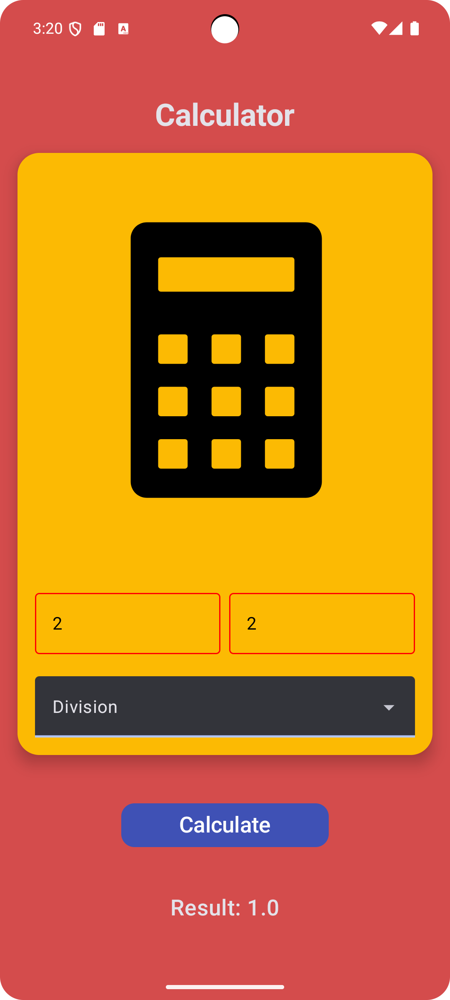

A simple and beautiful Calculator app made with **Jetpack Compose**!  
Perform basic arithmetic operations with a clean and colorful UI.

---

## ✨ Features

- Add, Subtract, Multiply, Divide numbers
- Beautiful UI using Jetpack Compose
- Dynamic result calculation
- Responsive design for different screen sizes

---

<p align="center">
  
</p>

---

## 🚀 Tech Stack

- Kotlin
- Jetpack Compose
- Android Studio

---

## 🛠️ Setup

1. Clone this repository:
    ```bash
    git clone https://github.com/your-username/calculator-app.git
    ```
2. Open in **Android Studio**
3. Run on an emulator or physical device

---

## 🤝 Contributing

Pull Requests are welcome!  
Feel free to suggest new features or report bugs.

---

## 📜 License

This project is licensed under the [MIT License](LICENSE).

---

Made with ❤️ by Aditya
