# 🧑‍💻 Jetpack Compose Projects by Dev-Aditya-More

A collection of mini-projects built using **Kotlin** and **Jetpack Compose**, showcasing modern Android development techniques.

---

### 1. 📱 ComposeCalculator
> A sleek calculator app using Jetpack Compose + MVVM + Room.

**✅ Features:**
- Basic calculator logic
- History tracking using Room
- Clean Compose UI

**🖼️ Screenshots:**

  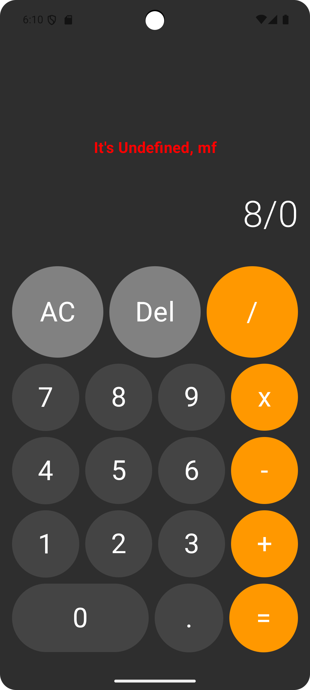

---

### 2. 🚀 JetpackComposeFitnessApp
> A playground project for testing animations, themes, and splash screens.

**✅ Features:**
- User authentication
- Dynamic theming
- Navigation with Compose

**🖼️ Screenshots:**

  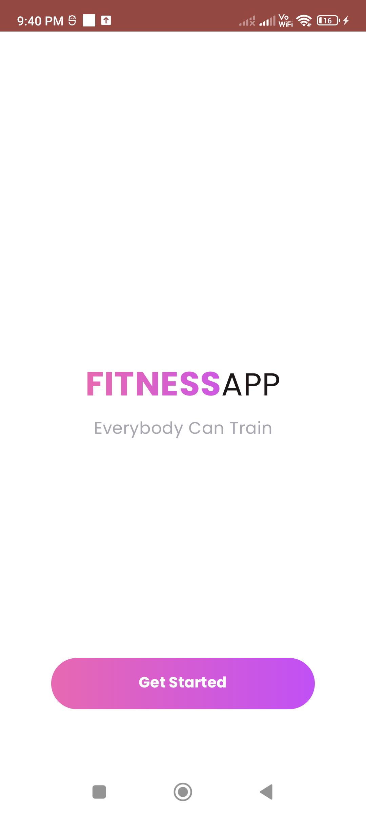
  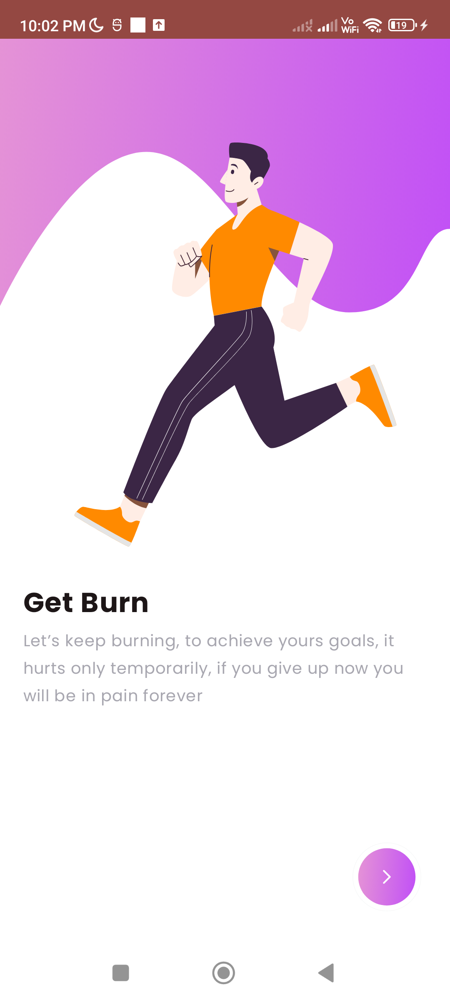
  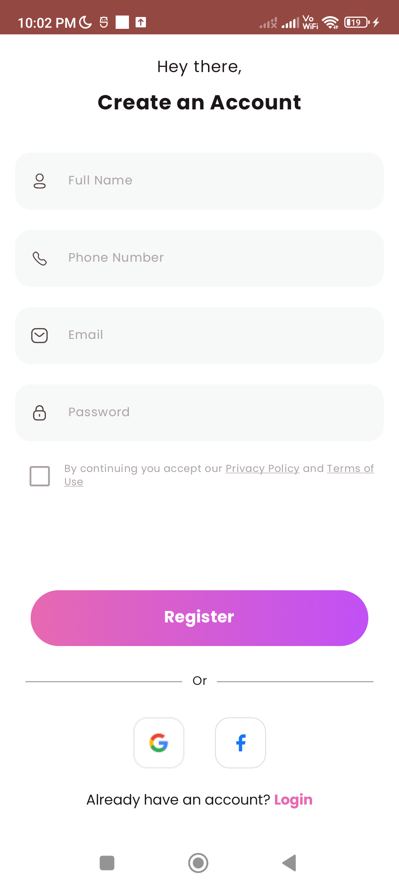
  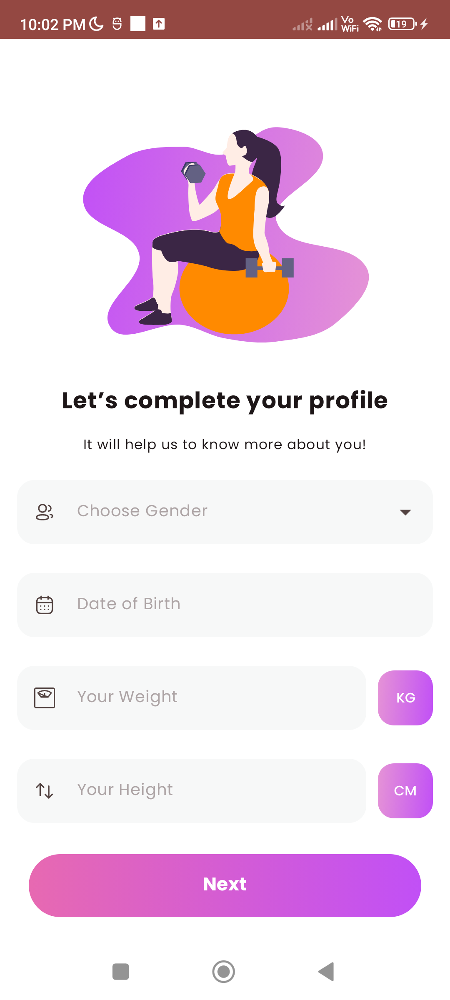
  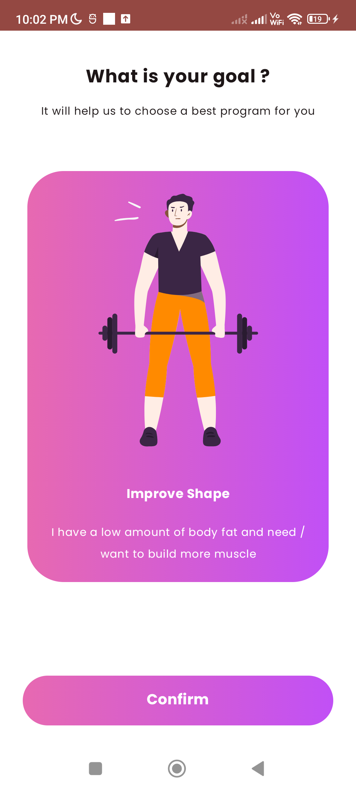
  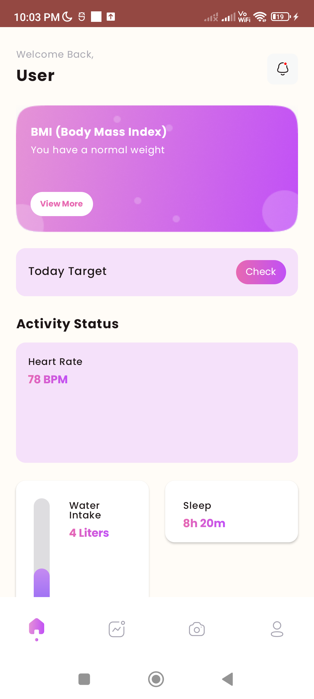
  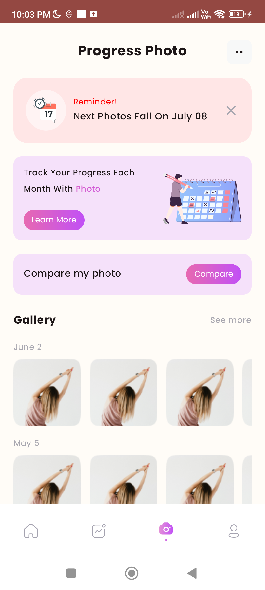
  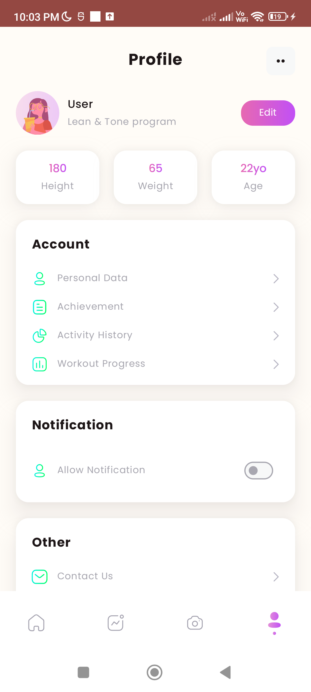
  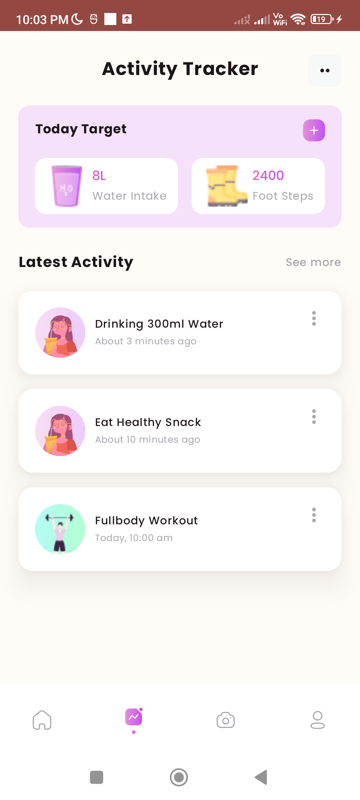

---

### 3. 🔐 LoginPageForm
> A login form with input validation and user feedback.

**✅ Features:**
- Username/password validation
- Form error states
- Clean reusable UI components

**🖼️ Screenshots:**

  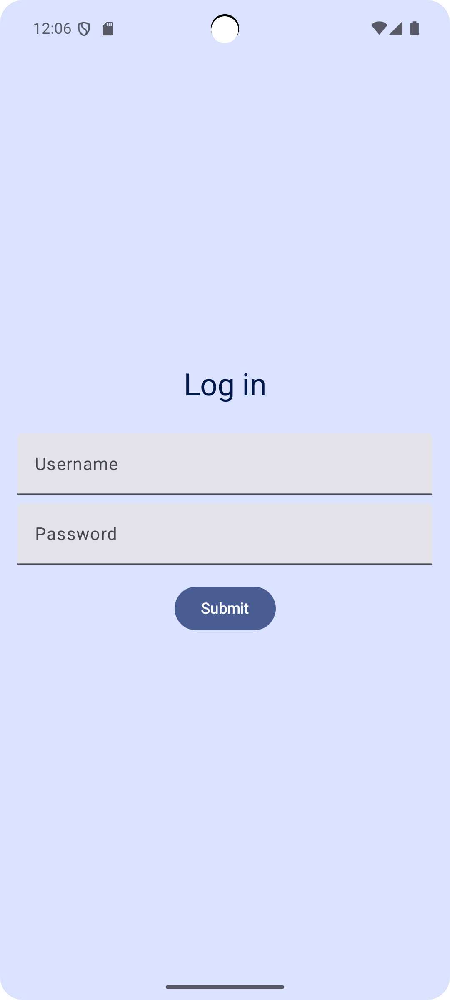
  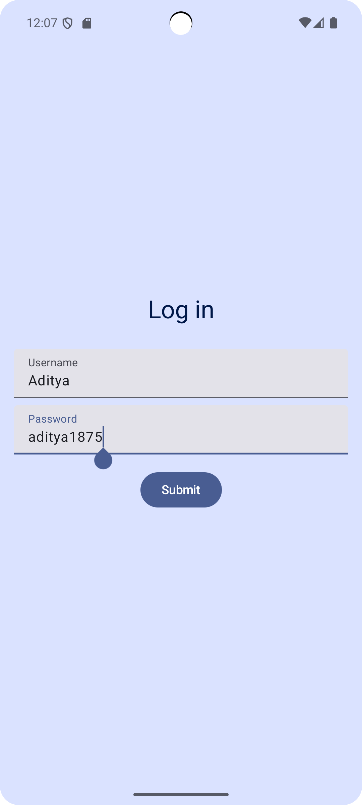
  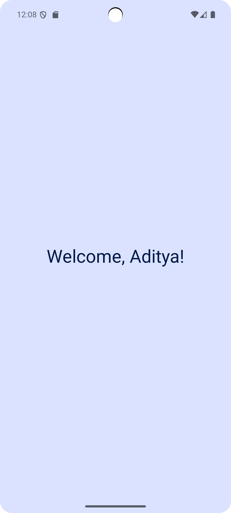

---

### 4. ✅ ToDoList
> A minimalist to-do app with local persistence.

**✅ Features:**
- Add/delete tasks
- Persisted via Room DB
- Simple Compose UI with ViewModel

**🖼️ Screenshots:**

  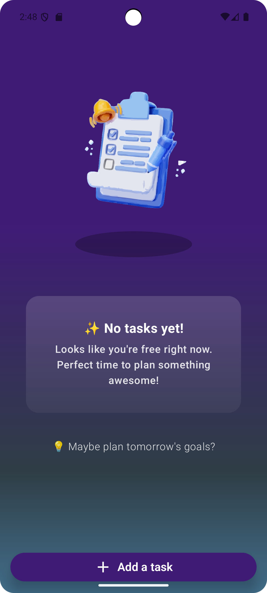
  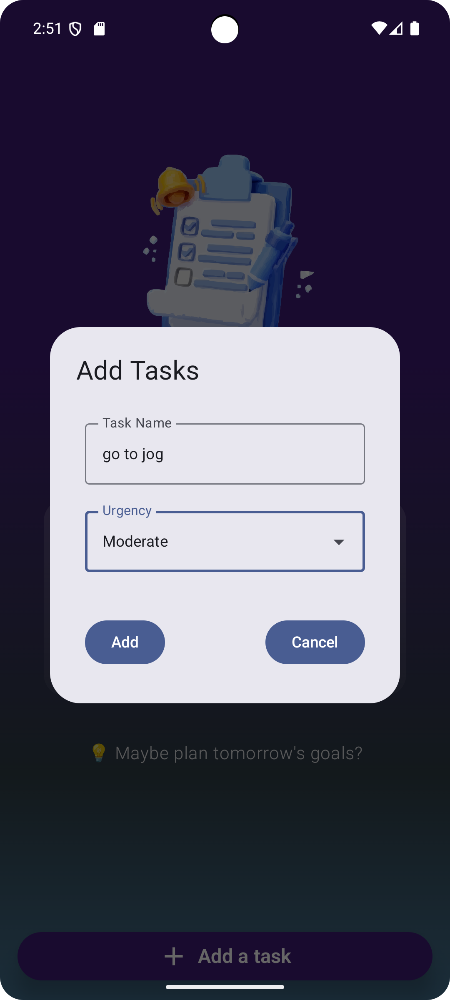
  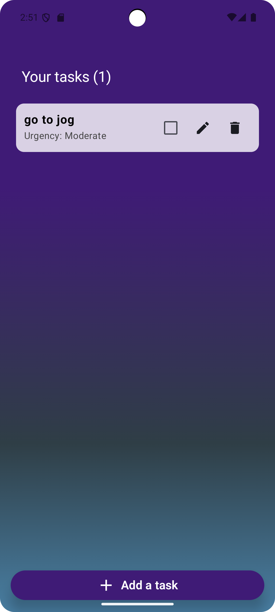
  

---
